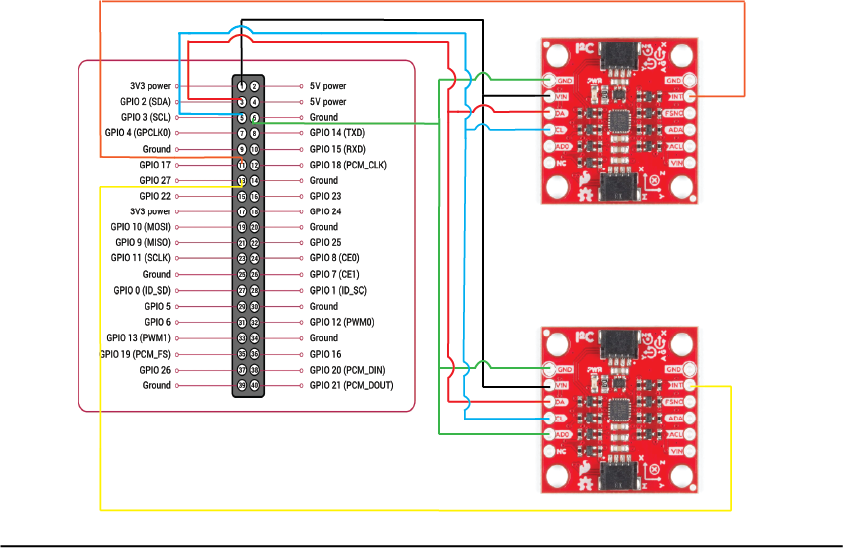

# SnAIRbeats
SnAirBeats is a next generation method to practice the drums, while reducing noise and space typically required to do so. The SnAirBeat set uses intertial measurement units (IMU) within the sticks to track their movement and play a corresponding drum, not requiring any physical hitting like modern electric drum sets need.

# Building
SnAIRBeats requires the following components to work:

* 1x  [Raspberry Pi 5](https://uk.rs-online.com/web/p/raspberry-pi/0219255)
* 2x  [SEN15335 Breakout IMU](https://uk.rs-online.com/web/p/sensor-development-tools/2836590)
* 1x  [External USB Speaker](https://thepihut.com/products/mini-external-usb-stereo-speaker?variant=31955934801&country=GB&currency=GBP&utm_medium=product_sync&utm_source=google&utm_content=sag_organic&utm_campaign=sag_organic&gad_source=1&gbraid=0AAAAADfQ4GEFlapDAiWBmf2emlHnIUtFT&gclid=CjwKCAjwwe2_BhBEEiwAM1I7sZX7Qgw-18XC8Lfv5pq3lkJwZNLx-_Mg28yoPVhgCK76qUmuxv67WhoC8xIQAvD_BwE)


The circuit's wires should be at least 1m long to ensure comfortable movement while playing to avoid risk of damaging the project.
A wiring guide can be seen below:




The drumsticks for the project need to be 3D printed via the [STLs](/STLs/) provided within this repository.

# Prerequisites
Firstly it should be noted that SnAIRBeats can only run on a Linux system. It is recommened to use a Raspberry Pi operating system such as [Raspebian](https://www.raspberrypi.com/software/) as the packages will not work on Windows systems.  

Before installing any of the prerequisites, please update your package list with:
```
sudo apt update
```

There are 4 main libraries that need to be installed for this project:
* Libgpiod - for general purpose input/output
* mraa - IoT and hardware interface library (required for IMU driver)
* YAML - Support for YAML (required for IMU driver)
* ALSA - To process and play sound files

These packages can be installed by running the following commands through the terminal of the Raspberry Pi.
```
sudo apt install -y libgpiod-dev
sudo apt install -y libmraa-dev
sudo apt install -y libyaml-dev
sudo apt install -y libasound2-dev
```


# Compliation from source

The project is built using a series of CMakeLists.txt which locate and link the required internal and external libraries for the project. By running the code below, the CMake will generate the respective make files within each of files. Running make will build the project and return an executable.


```
cmake .
make
```

It may take a few seconds for everything to build properly, but once everything has been successfully created you can use the code below to run SnAIRBeats.  

```
./SnairBeats
```

# Usage
SnAIRBeats works by reading the direction of acceleration within the IMUs. Holding the sticks with the X-direction representing the vertical axis:
* Hitting a stick down will play a snare drum
* Hitting a stick to either side will play a high tom
* Lunging the stick forward will play a crash cymbal

If desired, the sounds played by each direction can be changed by swapping files in the ALSAPlayer library found either [here](src/libs/ALSAPlayer/include) or through the command directory:
```
cd src/libs/ALSAPlayer/include
ls
```

## Maximum Latency
The highest sampling rate the SEN 15335 IMUs can work at is 1.125kHz.  
This value can be adjusted in the main.cpp file by altering the SampleRateDivider variable. This divides the sampling rate by 1+SampleRateDivider.  

We have found that the maximum latency the sticks can be reliably played at is 25Hz (1125Hz/44+1). While decreasing the latency may improve the sensitivity of the sticks, the higher this value is the greater the power consumption will be.

# Libraries
Here is a small description of each of the libraries used within the project and what they are used for.

## ALSAPlayer
ALSAPlayer takes .wav files from inside its [include folder](src/libs/ALSAPlayer/include/) and converts them into audio buffers using the ConvertFiles function. This library is heavily based off of driver written by [Adam Stark](https://github.com/adamstark) found at [https://github.com/adamstark/AudioFile](https://github.com/adamstark/AudioFile).

Audio devices are opened using the Open function which once finished can be used to play the created audiobuffers using the playFile function. The playFile function is built to play small audios and will interrupt itself, cancelling whatever is playing to play the next audio. This is much easier for SnAIRBeats compared to mixing as the interrupt of the drum notes is not noticable to the human ear, especially with the sample delay between each hit.

## GPIO
The GPIO library initialises the GPIO pins of the Raspberry Pi. Using [libgpiod](https://libgpiod.readthedocs.io/en/latest/), an event driven interrupt function called "worker" is used to read one of the GPIO pins for a HIGH value. The function is blocked until a rising edge event is seen in the GPIO pin selected in the constructor.  

The interrupt is data-ready based and therefore wakes whenever new data is available from the sensor. Within the constructor, 2 objects were passed in, the Maths object and the I2C-IMU driver. The new data is read from the IMU's registers using a read function and passed into a callback which inputs the data into the maths object to be thresholded.

## I2C
The I2C library is a driver written specifically for the [ICM-20948 chip](https://invensense.tdk.com/wp-content/uploads/2016/06/DS-000189-ICM-20948-v1.3.pdf) seen within the SEN 15335 IMU and is very heavily based off of driver written by [NTKot](https://github.com/NTkot) found at [https://github.com/NTkot/icm20948_i2c](https://github.com/NTkot/icm20948_i2c) with the Raw-Data-Ready interrupt turned on and the magnetometer turned off.

For each sensor used within the system, an object from this driver is built with a separate I2C address to differentiate between the two. These objects come with pre-built functions, must useful is the Read_Accel_Gyro which reads the registers of the IMU and stores the values in a variable within the object. These variables are what are passed into the IMUMaths callback through the GPIO worker whenever data is ready.

## IMUMaths
This libary was written to threshold the data that came through from the GPIO worker and has two main goals. Firstly it reads the data passed through and checks whether any of the values correlate to a hit and then play the corresponding audio from the ALSAAudio object. It also contains a sample delay to stop multiple sounds being played from the same hit. This is achieved using a simple boolean that is turned true after a hit is detected and waits a set number of samples before the boolean flips back, allowing another hit to be detected.


# Unit tests
This project uses unit testing to validate the functionality of the key classes, including classes responsible for IMU data processing and audio playback.

Tests are written using the GoogleTest framework and integrated with CTest for easy execution.

To run the tests from the root directory, use:
```
./run_tests
```
or to use CMake directly, run:
```
ctest
```

# Documentation
Complete documentation for this project can be found in [documentation.pdf](./documentation.pdf).

# Sponsorship and funding
We are extremely grateful for RS Components for providing us with components that allowed us to complete this project. We are also very grateful to the ENG5220 Real Time Embedded Programming lecturers and teaching assistants for their guidance throughout the past three months.

# Media
* [Instagram](https://www.instagram.com/snairbeats/)

# Authors
* Calum Robertson
* Aleksandar Zahariev
* Mohammed Alqabandi
* Renata Cia Sanches Loberto
* Alejandra Paja Garcia

# Licenses
The IMU driver has been adapted from the driver written by [NTKot](https://github.com/NTkot) and can be found at [https://github.com/NTkot/icm20948_i2c](https://github.com/NTkot/icm20948_i2c)

The ALSAPlayer library has been adapted from the driver written by [Adam Stark](https://github.com/adamstark) and can be found at [https://github.com/adamstark/AudioFile](https://github.com/adamstark/AudioFile)